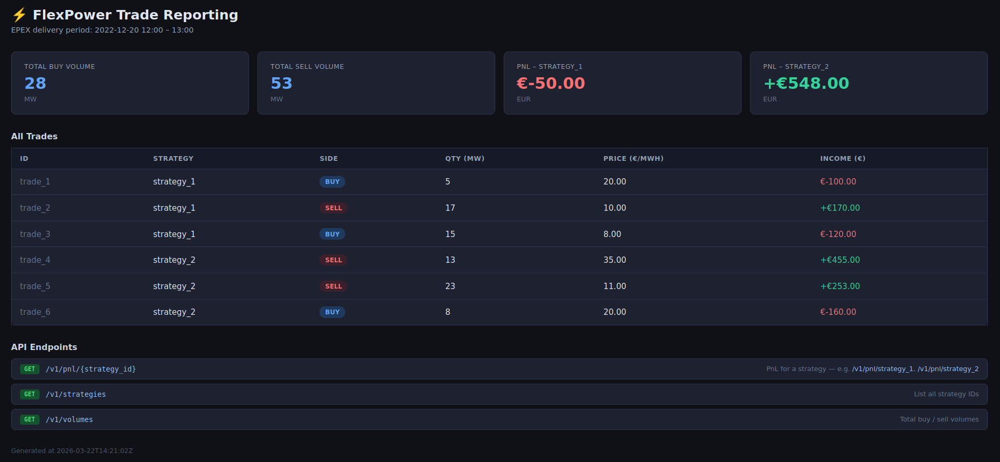
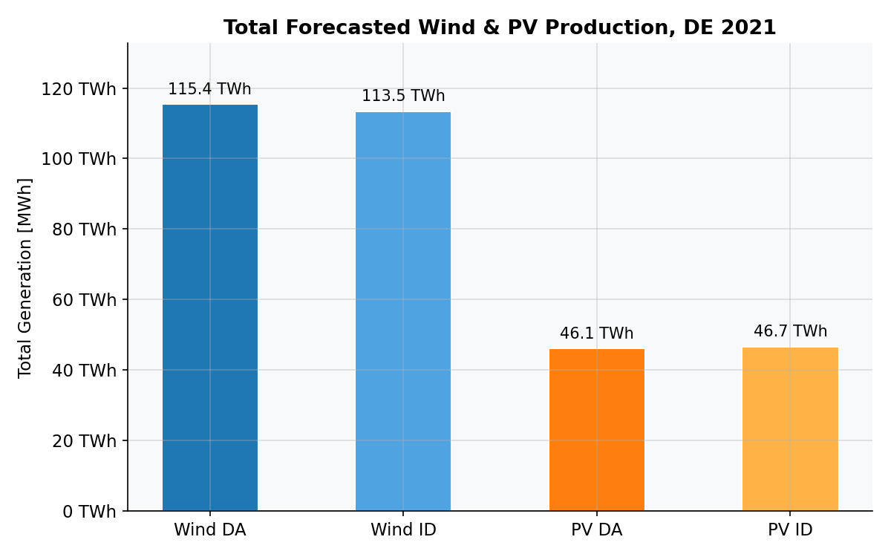
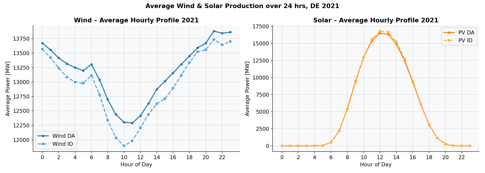
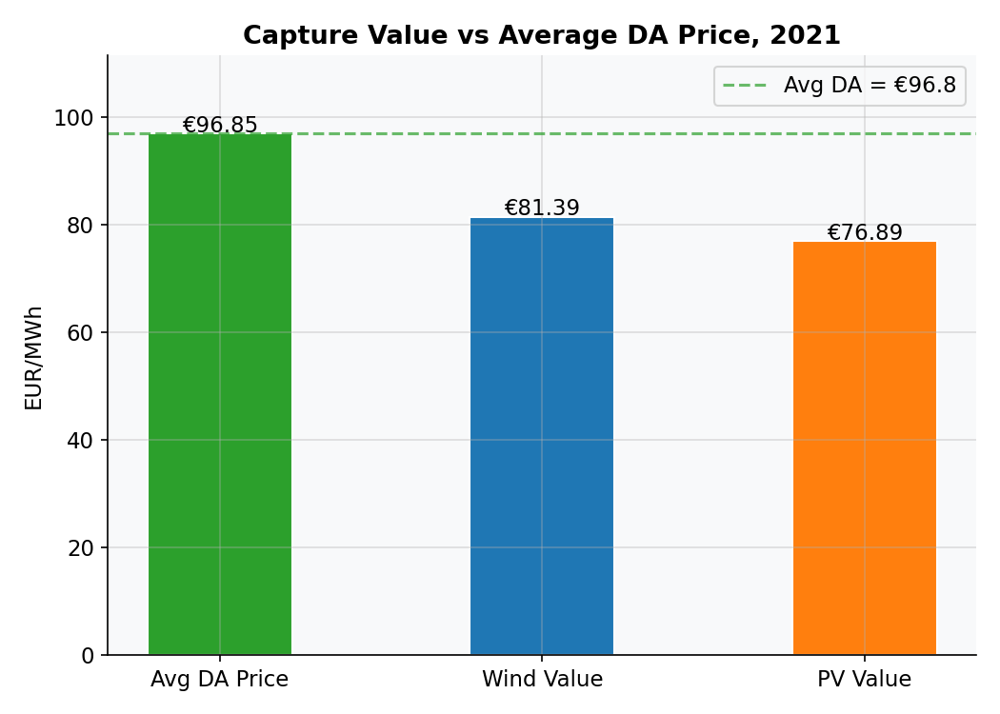
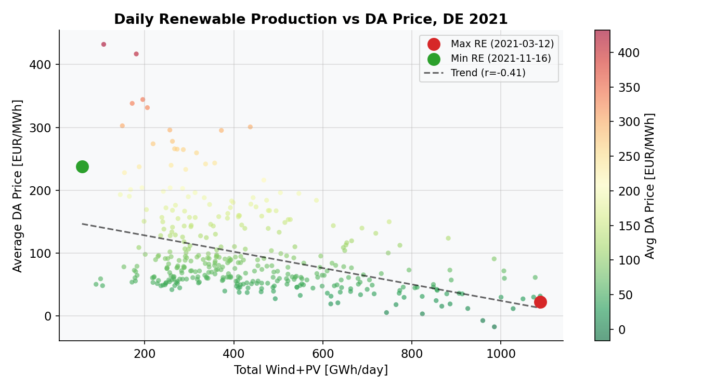
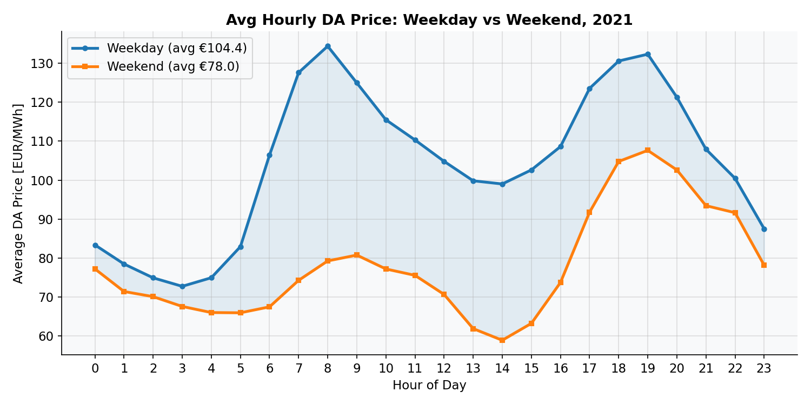
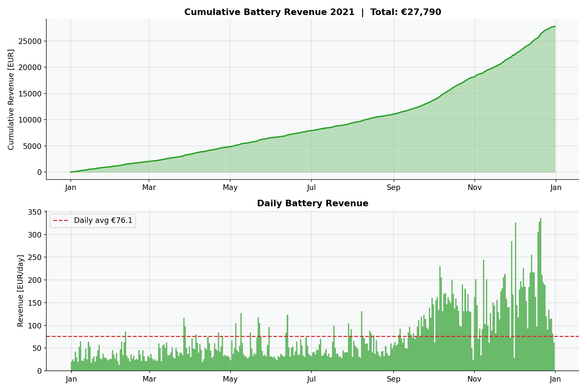
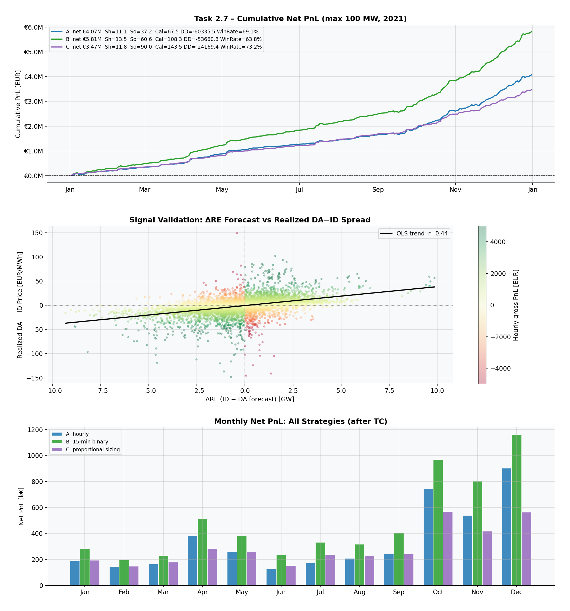
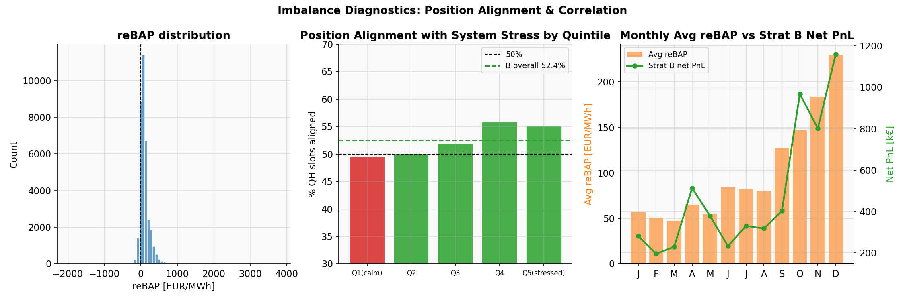
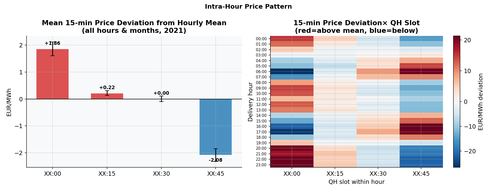

# FlexPower Quant Challenge – Solution

Did FlexPower Quant Challenge from 2023 for some fun learning. Beware of all limitations described below. 

## Contents
- [Project Structure](#project-structure)
- [Task 1 – Reporting Tool](#task-1--minimal-reporting-tool)
- [Task 2 – Data Analysis](#task-2--data-analysis)
- [Task 2.7 – Trading Strategies](#task-27--trading-strategies)
- [Assumptions, Limitations & Next Steps](#assumptions-limitations--next-steps)

---

## Project Structure

```
quant_challenge/
├── data/
│   ├── trades.sqlite
│   └── analysis_task_data.xlsx
├── task1/
│   └── reporting.py
├── task2/
│   ├── analysis.py
│   └── plots/
└── README.md
```

---

## Task 1 – Minimal Reporting Tool

### Running

```bash
python task1/reporting.py
# CLI demo prints volumes + PnL, then starts the Flask API

curl http://127.0.0.1:5000/v1/pnl/strategy_1
curl http://127.0.0.1:5000/v1/strategies
curl http://127.0.0.1:5000/v1/volumes
```

Or open 127.0.0.1:5000 in your browser. The dashboard will show up, displaying the same results, but in a nicer way.



PnL sign convention: selling earns +quantity x price; buying costs -quantity x price.

---

## Task 2 – Data Analysis

```bash
python task2/analysis.py
```

### 2.1 Total Forecasted Production 2021

15-min MW (QH values) x 0.25 -> MWh.

| Source | DA | ID |
|---|---|---|
| Wind | 115.4 TWh | 113.5 TWh |
| PV | 46.1 TWh | 46.7 TWh |



### 2.2 Average 24h Profile

Wind: flat with slight nocturnal peak. PV: bell curve peaking at solar noon, zero at night.



### 2.3 Capture Value

| | EUR/MWh |
|---|---|
| Avg DA price | 96.85 |
| Wind capture | 81.39 (-15.46) |
| PV capture | 76.89 (-19.96) |

Both below average due to the merit-order effect: wind and PV produce exactly when supply is abundant, lowering prices. PV additionally suffers the fact that all solar farms peak simultaneously around midday.




### 2.4 Extreme RE Days

| | Date | RE [GWh] | Avg DA Price |
|---|---|---|---|
| Max RE | 2021-03-12 | 1,088 | 22.3 EUR/MWh |
| Min RE | 2021-11-16 | 59 | 237.5 EUR/MWh |

~10x price difference. High-RE days: zero-marginal-cost renewables displace expensive thermal plants. In low-RE days in late 2021 prices increased also due to the European gas crisis.



### 2.5 Weekday vs Weekend

Weekday: 104.37 EUR/MWh vs Weekend: 77.98 EUR/MWh (+26.38 EUR/MWh premium). Industrial/commercial demand drives weekday prices; same baseload supply with lower weekend demand creates surplus.



### 2.6 Battery Revenue (1 MWh, 1 cycle/day)

Rule: charge at DA price minimum, discharge at DA price maximum after that. Total annual revenue: 27,789 EUR (avg 76.14 EUR/day). All days had a positive spread in 2021.



---

## 2.7 Trading Strategies

## Disclaimer!

Due to the small dataset size, no proper OOS validation/testing is possible, need ideally 3 years or more. This means: everything is kind of in-sample, within one specific year, that also was quite extreme due to the gas crisis. Therefore **all the metrics (Sharpe/Sortino/Calmar) are inflated**. Expect materially lower values in a calmer OOS period, and use them here as a relative strategy-comparison diagnostic only. Strategies and their execution are also simplified. This is to show an idea/prototype of what can be traded and how. 

I have a separate project in power trading, so far DA-only and not using generation forecasts. But there, as I have 10+ years of data, I can (and plan) to test ID and forecast error-based strategies.


### Market structure

**Day-ahead auction:** 12:00 on D1. All bids/asks submitted simultaneously. Exchange publishes a single clearing price per hour at ~13:00. 

**Intraday continuous:** opens 15:00 on D1, closes 5 min before delivery. Two products:
- ID Hourly: same 1-hour blocks as DA, is intended to offset DA position, one order.
- ID 15-min: quarter-hour blocks. More liquid, but 4 orders per hour and introduces basis risk vs the hourly DA price.


### Transaction cost model

**Exchange fee: 0.10 EUR/MWh (ID leg)**
Source: EPEX SPOT Price List (valid 1 Jan 2015), DE-AT-FR-CH Continuous Intraday Market = 0.10 EUR/MWh per side. Our strategy closes a DA position with an ID trade/s, paying the ID leg fee only. The DA leg fee is embedded in the auction clearing mechanism.

**Execution cost -- bid-ask: 0.63 EUR/MWh**
Source: Baule & Naumann (2022, MDPI Energies, doi:10.3390/en15176344), using the full EPEX SPOT order book history (2017–2018) for German hourly continuous intraday contracts. They show:

- Mean buying premium vs DA: 0.59 EUR/MWh
- Mean selling premium vs DA: 0.67 EUR/MWh
- Use an average for simplicity: **0.63 EUR/MWh**

This is the empirically measured average price paid above (or received below) the DA price when working a 100 MWh order through the EPEX SPOT order book during the final liquid trading hours. It inherently captures both bid-ask spread and market impact. 

**On market impact modelling:**

The 0.63 EUR/MWh captures bid-ask and presumably consequent temporary impact. Permanent market impact, i.e., the post-trade price adjustment after the orders move the book, needs to be added separately. 
- Permanent impact from here 10.48550/arXiv.2009.07892: ~0.10 EUR/MWh for 100 MW in liquid hours (very roughly determined from the plot).

| Component | Value | Source |
|---|---|---|
| Exchange fee | 0.10 EUR/MWh | EPEX SPOT Price List Jan 2015 |
| Bid-ask | 0.63 EUR/MWh | doi:10.3390/en15176344 |
| Permanent market impact | ~0.10 EUR/MWh | 10.48550/arXiv.2009.07892 |
| **Total** | **0.83 EUR/MWh** | |

**Important caveats**
- The numbers are NOT from 2021.
- The dataset provides a single price per delivery period for both the H and QH ID markets, with the exact aggregation not specified. EPEX publishes several ID price indices, e.g. ID1 (VWAP of final hour before delivery), ID3 (3-hour VWAP) etc. This distinction matters for TC modelling, specifically for bid-ask number. 
- I assumed that temporary market impact is included in bid-ask, and permanent was roughly eyeballed from the plot in the paper.
**Conclusion**: TC are an idea of order of magnitude and an attempt to include more realism. All strategies will still yield positive mothly revenue even if all the costs were 3x higher.


### Signal

**ΔRE = (wind_id + pv_id) − (wind_da + pv_da)** [MW]

Both forecasts are available before trading closes. The sign of ΔRE is grounded in supply/demand:
- ΔRE > 0: more supply than DA priced -> ID price falls below DA -> short the spread
- ΔRE < 0: less supply than expected -> ID price rises above DA -> long the spread

### Strategies

**Strategy A**: hourly product, +-100 MW, executed at realized ID hourly price.

**Strategy B**: 15-min product, +- 100 MW (4 x 25 MWh QH trades), executed at realized ID 15-min price. Higher gross PnL than A because 15-min prices have more intra-hour variance for the ΔRE signal to exploit.

**Strategy C**: 15-min product, position sizing proportional to how unusual |ΔRE| is relative to the same hour-of-day, using a rolling z-score to account for seasonality.
z = (|ΔRE| - rolling_mean_same_hour) / rolling_std_same_hour.

scalar = clip(z, 0, 1); 

0 = at or below the conditional mean -> no position; 1 = at least one conditional std above the mean -> full 100 MW.

The rolling window uses 30 days of same-hour observations and is shifted by 1 period to avoid look-ahead. This is still in-sample and should be validated OOS.

### Results

| | A | B | C |
|---|---|---|---|
| Gross PnL (EUR) | 4,797,842 | 6,540,623 | 3,672,403 |
| Net PnL (EUR) | 4,070,845 | 5,813,543 | 3,467,803 |
| TC drag | 15.2% | 11.1% | 5.9% |
| Win rate (active) | 69.1% | 63.8% | 73.2% |
| Max daily drawdown (EUR) | −60,336 | −53,661 | -24,169 |
| Avg effective position | 100 MW | 100 MW | ~30 MW |
| Sharpe/Sortino/Calmar (inflated) | 9.25/37.2/67.5 | 11.18/60.6/108.3 | 11.81/90.0/143.5 |

 **The performance ratios are overstated vs a typical year — 75% of 2021 PnL came from Oct–Dec driven by the gas crisis.** Also, Sharpe is not fully appropriate due to skewed and heavy-tailed PnL distributions. 



### Imbalance Price Diagnostics

Imbalance prices (assumed to be reBAP) are used here as an **ex-post diagnostic** to see whether strategy positions align with realized system stress. As a side note, imbalance itself, as a real-time forecast, can be used in trading, but these realized prices -- not, since they are published with delay.

| Metric | Value |
|---|---|
| B winning QH slots | 54.0% |
| B losing QH slots | 49.8% |
| Pearson r: DA-ID spread vs imbalance price | −0.27 |

Overall alignment is only slightly above 50%, indicating that ΔRE captures some directional information, but remains a weak proxy for system imbalance. Alignment is somewhat stronger on profitable slots, which is directionally consistent with the strategy logic.

The DA–ID spread shows a stronger (though still moderate) relationship with imbalance prices (r = −0.27), suggesting that combining ΔRE with ex-ante imbalance indicators or forecasts could improve signal quality.



### Intra-hour Price Momentum 

What I also could see is a pattern resembling intra-hour momentum: during some ramp-up hours prices tend to increase across QH slots, while during ramp-down hours they tend to decrease. However, this effect is likely not stable and varies by hour-of-day and market conditions.

The literature (e.g. https://doi.org/10.1016/j.eneco.2022.106125) suggests that forecasting such short-term price dynamics can yield meaningful trading strategies. Exploring this further would require a longer time series and proper out-of-sample validation.



---

## Limitations & Next Steps

**1. Only one year of data**
No OOS validation possible. Strategies A and B are as simple ("parameter-free") as possible to mitigate this, but 2021 was an extreme year. 
Usual metrics like Sharpe/Sortino/Calmar are not reliable and should be treated as materially overstated relative to a calmer year. 
Need 3+ years with walk-forward folds for proper validation.

**2. Transaction cost model limitations**
Numbers are used as a rough idea. For permanent market impact, proper modeling is needed. Execution costs like bid-ask also need to be separated by hours and seasons, they are not the same of those. 

**3. Unknown execution price definition**
Execution price definition (full-session, ID1/ID3 VWAP or something else) is important for TC estimation.

**4. Strategy C in-sample normalisation**
Although the normalization is based only on past data (via rolling lagged statistics), it is still effectively in-sample, 
as the scaling and window choice are calibrated on the same dataset and not validated across different regimes.

**What would make it better:**
- 3+ years of data for walk-forward validation of all strategies
- EPEX M7 order book data for a calibrated, volume-dependent TC model; current exchange fees
- Real-time forecast feed for live signal
- OOS regime analysis across 2019–2023 or more
- Rolling normalisation for Strategy C using a trailing historical window
- Near-real-time TSO balance data 

---

## Dependencies

```
pandas / openpyxl / matplotlib / seaborn / scipy / flask
```
